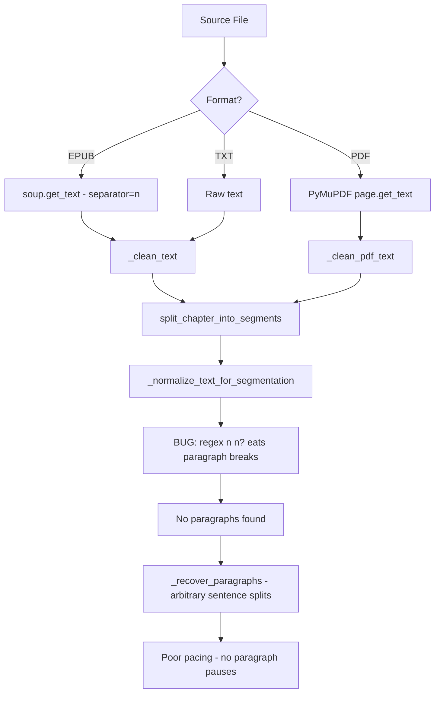

# Fix: Respect Original Paragraph Formatting in Text Splitting

## Problem

When splitting book text into TTS segments, the original paragraph formatting is being destroyed, resulting in poor audio pacing. Paragraphs are merged together, removing natural pauses that the author intended.

## Root Cause

### Bug 1 (Critical): Regex in `_normalize_text_for_segmentation()` destroys paragraph breaks

**File:** `app/audiobook_parser.py`, line 225

```python
text = re.sub(r"([a-z0-9])\n\n?([a-z])", r"\1 \2", text)
```

The `\n\n?` pattern matches **both** single newlines (word-wrap) **and** double newlines (paragraph breaks). When a paragraph ends with a lowercase letter and the next begins with one — extremely common in fiction — the paragraph boundary is destroyed **before** the `<PARA>` placeholder logic ever runs.

**Example:**
```
...and he walked away.\n\nthe next day was sunny...
```
The regex matches `y\n\nt` → replaces with `y t` → paragraph boundary gone.

### Bug 2 (EPUB): BeautifulSoup collapses `<p>` tag boundaries to single newlines

**File:** `app/audiobook_parsers.py`, line 83

```python
text = soup.get_text(separator="\n", strip=True)
```

Using `\n` as separator means consecutive `<p>` tags produce only a single newline between them. Combined with Bug 1, EPUB paragraph structure is completely lost.

## Data Flow



## Fix Plan

### Fix 1: Correct the regex in `_normalize_text_for_segmentation()`

**File:** `app/audiobook_parser.py`, line 225

Change `\n\n?` to `\n` so it only matches single newlines (word-wrap), never double newlines (paragraph breaks):

```python
# Before (buggy):
text = re.sub(r"([a-z0-9])\n\n?([a-z])", r"\1 \2", text)

# After (fixed):
text = re.sub(r"([a-z0-9])\n([a-z])", r"\1 \2", text)
```

This ensures paragraph breaks (double newlines) survive to be detected by the `<PARA>` placeholder logic on line 232.

### Fix 2: EPUB parser — preserve block-level element boundaries

**File:** `app/audiobook_parsers.py`, lines 64-93

Before calling `get_text()`, insert explicit `\n\n` markers after block-level HTML elements (p, div, h1-h6, li, blockquote, section, article) so paragraph boundaries are preserved as double newlines:

```python
# Insert paragraph markers after block-level elements
for tag in soup.find_all(["p", "div", "h1", "h2", "h3", "h4", "h5", "h6", 
                           "li", "blockquote", "section", "article", "tr"]):
    tag.insert_after(soup.new_string("\n\n"))

# Use single space as inline separator, paragraph breaks come from markers above
text = soup.get_text(separator=" ", strip=True)
```

This produces proper `\n\n` between paragraphs while keeping inline elements (em, strong, span) joined with spaces.

### Fix 3: Verify PDF parser paragraph preservation

**File:** `app/audiobook_parsers.py`, `_clean_pdf_text()` line 233

The existing regex `([a-z0-9])\n([a-z])` already only matches single newlines — this is correct. No change needed, but verify that PyMuPDF's `page.get_text("text")` produces `\n\n` between paragraphs (it typically does).

## Expected Outcome

After the fix:
1. Paragraphs from the original document are preserved as segment boundaries
2. Each paragraph becomes its own segment (if under `max_chars=800`)
3. Oversized paragraphs are split at sentence boundaries within the paragraph
4. Audio playback has natural pauses at paragraph boundaries
5. The `_recover_paragraphs()` fallback is rarely needed since real paragraphs are detected

## Files to Modify

| File | Change |
|------|--------|
| `app/audiobook_parser.py` | Fix regex on line 225: `\n\n?` → `\n` |
| `app/audiobook_parsers.py` | EPUB parser: add block-element markers before `get_text()` |
